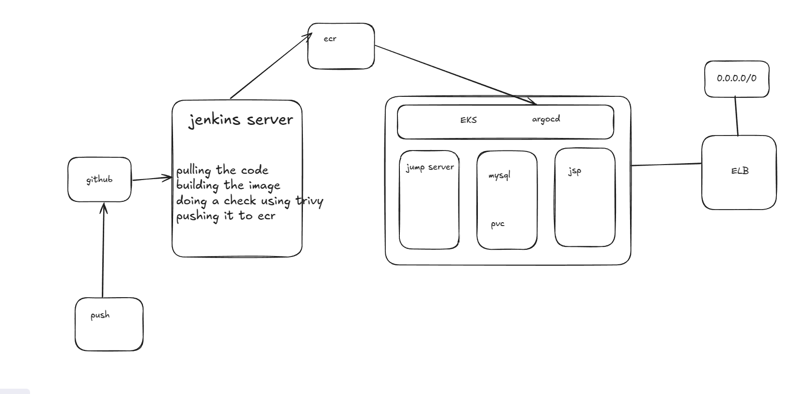
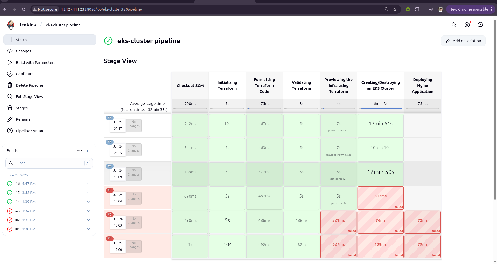
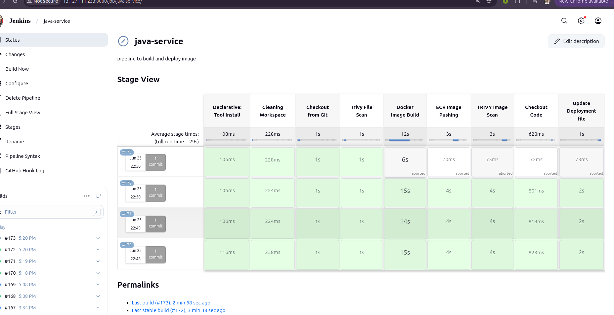
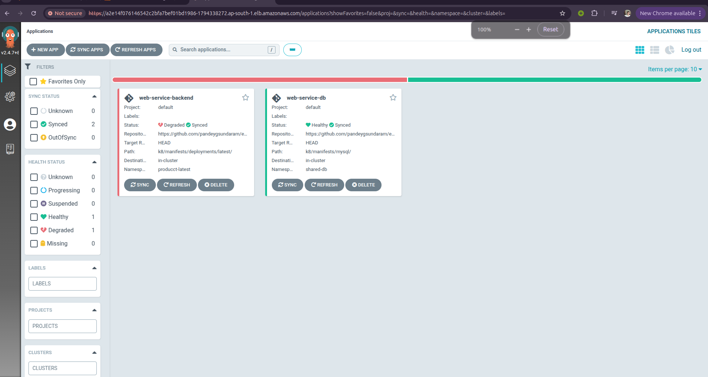
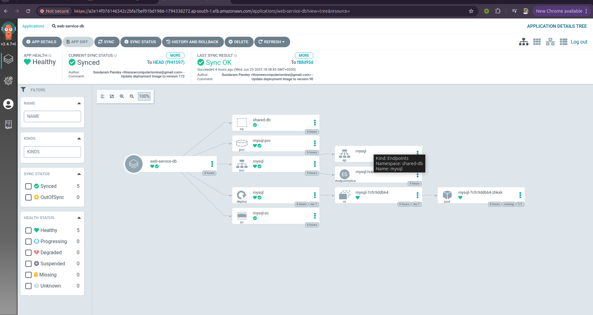
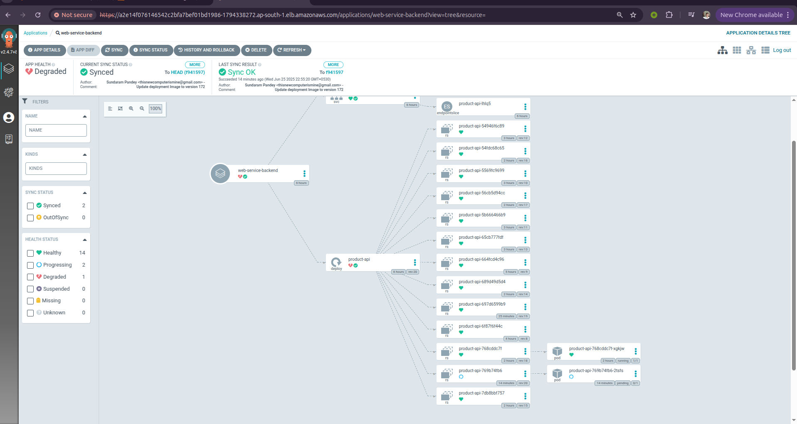

# 🧠 System Architecture Overview

Welcome to the official documentation of our system architecture.  
We're building a system so automated, it practically drinks your coffee for you.

---

## 1. 🔧 Infrastructure Layout

The base setup includes the VPC, subnets, EC2 bastion, and EKS cluster. Everything lives on AWS like a fancy server farm.

---

## 2. 🧱 Microservice Architecture

Services are containerized, namespaced, and bossed around by Kubernetes.

---

## 3. 🔄 CI/CD Pipeline (Jenkins Style)

Let’s talk about the pipeline — where the DevOps magic happens and Jenkins flexes its automation muscles.

### 🛠️ Jenkins builds infra and EKS cluster

This stage provisions the VPC, bastion, and EKS cluster using Terraform like a true Infrastructure as Code (IaC) champ.

### 🐳 Jenkins builds and pushes app images

Here, Jenkins builds Docker images, scans them, and deploys to the EKS cluster. CI/CD, baby!

---

## 4. 🚀 ArgoCD Deployment Strategy

ArgoCD comes in hot to manage deployments like the GitOps boss it is.

### 🔁 ArgoCD syncing applications from Git

It pulls manifests from the repo and applies them automagically to your cluster.

### 🔍 ArgoCD UI & Version Control

Track deployments, rollbacks, and sync status with a sleek UI.

---

## 🎥 Video Walkthrough (YouTube)

Prefer watching over reading? No judgment — here's a quick walkthrough video explaining the entire setup, including Terraform, Jenkins, ArgoCD, and how it all ties together.

> 📺 [Click here to watch directly on YouTube](https://youtu.be/eN2122hHR3U)

---